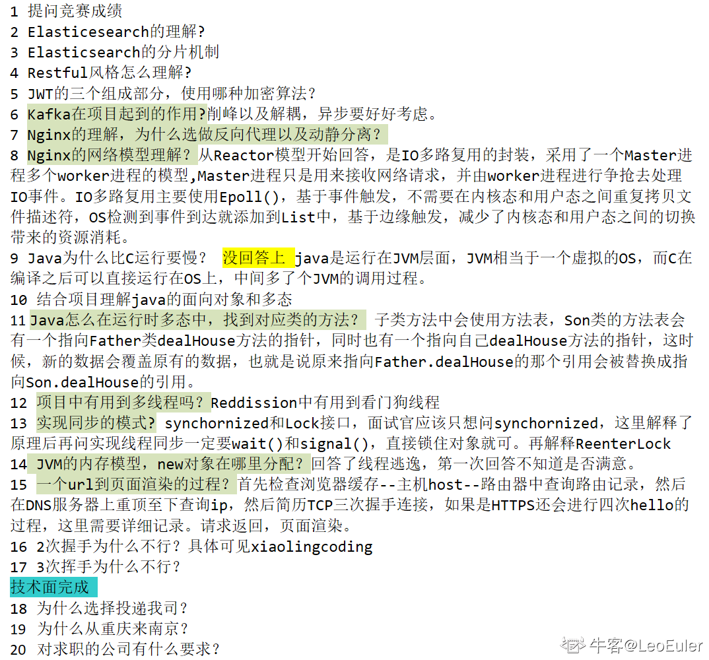

# 趋势科技面经
- 笔试8.5
 1. 指定字符串替换
 2. 矩阵中找出独立图形数目并计算最大曼哈顿距离
- 一面 8.11
- 二面 8.17 已挂

### 1. 面经
作者：空空空空心
链接：https://www.nowcoder.com/discuss/943313
来源：牛客网

- 1.项目中用到了ES， 说一下为什么要用ES？（没答上来）
- 2.说一下Redis的几个基本数据类型
自己谈String的底层数据结构的时候说到了和C的不一样，说C字符串会造成字符串拼接错误，问怎么发生错误的，我自己说不清楚。。。
- 3.redis的缓存雪崩、缓存击穿场景
- 4.如何定位MySQL的慢查询语句 mysqldumpslow工具

    ```mysqldumpslow -s c -t 10 /var/run/mysqld/mysqld-slow.log```

- 5.MySQL索引的底层数据结构
- 6.讲讲当时笔试的时候写得一道题的思路（编辑距离那道，当时脑袋一片空白，这地方花了很长时间还是没讲出来）
- 7.讲讲动态规划的特性啥的
- 8.项目是给学校做的吗？（校园论坛讨论区，就是仿牛客网那个）
答：不是
- 9.那是你自己做的这个项目吗？
答：自己网上找的敲的
- 10.平时学习通过哪些渠道？

---

### 2. 面经

作者：Happysnaker
链接：https://www.nowcoder.com/discuss/970793
来源：牛客网

- 自我介绍
- 为什么大二就来实习，能实习多久？
- 小程序的登录是怎么做的，详细流程？
- 后台管理系统账号密码传输是明文吗？
- 当然不是，回答用了 HTTPS 加密。
- HTTPS 一定能保证安全吗？
- 额，我说可以，面试官没反馈...
- 除了 HTTPS 还有其他什么能够保证安全的协议吗？
- 我说应用层好像没有了，然后就谈了谈 IPsec 协议，说了说新首部封装，MAC 尾部封装，隧道技术，然后说了说 VPN 的实现就是基于 IPsec。
- 谈的比较浅，因为了解的也不多，好在面试官也没多问。
- 除了 IPSec 呢？还有什么协议能保障通信安全？
- 卑微，不知道。
- 密码在数据库中是明文存储的吗？
- 不是，加盐？
- 什么是加盐，为什么要加盐？
- 早期使用散列加密相似的密码碰撞概率高，黑客破解了一个可能就能破解多个，因此加上随机盐值进行散列，降低碰撞，降低风险。
- 加盐后还能知道原始密码吗？
- 不能，只能验证。
- 散列算法了解哪些？
- MD5, ASH。
- MD5 原理知道吗？
- 啥玩意？不知道，回来恶补了一下，现在（写此面经的时候）又给忘了...
- 两类密码体制。
- 对称非对称
- 块密码原理了解吗？
- 早期使用输入输出表，但表可能过大，因此使用函数与置乱函数作为替代。
- 流密码了解吗？
- 不知道。
- 项目中 Redis 怎么用的，Redis 数据类型？Redis 持久化方式？
- 终于结束安全问题了...
- 能解释下 Redis 为什么这么快吗？
- 丰富、高效的数据结构。
- 串行化的处理方式，避免线程切换开销。
- IO 多路复用机制。
- 6.0 之后引入多线程处理 IO 数据。
- 项目中 rabbitmq 怎么用的?
- mq 如何保障你项目中的一致性？
- 手动 ack，确认和事务机制。
- mq 如何避免重复消费？
- 两点原因导致，一是生产者投放多条重复消息，这个很好控制，另一个是消费者由于网络异常使得消费者与 mq 连接断开，这会导致 mq 会重新投放消息引起重复消费，我说可以用 redis 缓存唯一消息 id，面试官不满意，请问下还有啥解决办法啊？
- 消费者是怎么做模块区分的？
- 不知道面试官想问啥，没理解，我说我项目是单机的...
- 项目是单机的？也就是说这个项目可以不要 mq？
- 完蛋，魂淡啊，你还指望一个大一学生（项目是大一写的）写出啥高级的分布式微服务项目？
- 分页怎么做的？
- 用 Limit 字句。
- 会有什么性能问题呢？
- 然后给面试官扯了扯 limit 的优化？
- 用过分页插件吗？
- 无......
- 用了 mybatis 是吧，启动流程是怎么样的呢？
- 这里我不太了解，根据自己理解扯了扯扫描 xml 然后动态代理。
- 平时怎么学习 Java 的？
- 你项目中用到了 Java 中的哪些集合？介绍一下这些集合吧。
- List 讲讲吧，有几种实现呢？
- ArrayList 内部内存是连续的吗？
- 我说使用数组，是连续的，面试官说不对再想想，然后想了想说数组本身是连续的，但是数组指向内容不一定是连续的。
- 谈谈你对 Java 中引用的理解。
- 我说引用就是指针...
- 好，那你说说你对指针的理解。
- Java 和 C++ 你更喜欢哪个？
- 为什么说 Java 是跨平台的？
- 你项目里是如何做权限管理的？
- 晕，怎么还问项目，SpringSecurity 做的。
- 写题，文件中记录了用户访问记录，用户可以多次访问，将他们按照访问次数排序，去重后重新写入文件。
- 简单题，文件 API 忘记了，面试官让百度，然后就秒了。
- 反问。

---

### 3. 面经
作者：牛牛哥牛不牛
链接：https://www.nowcoder.com/discuss/953122
来源：牛客网

面经：（1h）
- 1：介绍下实验室的深度学习的项目；
- 2：讲一讲java的集合，hashmap源码里面有哪些让你印象深刻的代码（我答的是扩容时候迁移节点时候的计算下标的代码，&上hashmap原来的长度）
- 3：打开一个网址之后会发生什么（查询DNS，TCP， HTTP请求一条龙）
- 4：ARP协议
- 5：端口映射，NAT转换
- 6：为什么想来趋势，从哪里了解趋势的

---

### 4. 面经
作者：阿晨在工作
链接：https://www.nowcoder.com/discuss/946439
来源：牛客网

- 1.项目上线了吗？
- 2.OAuth2.0的优势什么？用户登陆的过程是什么样的？
- 3.系统存放了哪些用户的信息
- 4.权限管理怎么做的，普通用户有哪些权限？管理员可以配置普通用户的管理权限吗？
- 5-8.在问项目细节，问的非常细，会不停追问。
9.对热搜了解吗，怎么做？
10.置顶redis存放的格式是什么？redis的数据格式？
- 11.redis中zset是什么类型？
- 12.list里面塞一个记录用什么命令？
- 13.热搜你打算等第一个请求过来才做缓存吗？怎么解决？
- 14.多长时间做一次预热呢？过程中怎么更新呢？
- 15.java中怎么执行一个定期的任务
- 16.打开一个网站涉及到哪些网络协议？
- 17.怎么用命令行查看一个域名对应的IP 
- 18.Ping底层是什么协议？
- 19.ARP协议是什么听过吗？将IP地址解析成MAC地址，在ARP缓存中存储了这一样的映射关系
- 20.linux服务器反应特别慢？怎么排查？
- 21.java多路复用I/O解决的是什么问题？
- 22.如果不用多路复用IO，一般用什么样的方式？
- 23.final关键字干嘛用的？
- 24.抽象类和接口的区别
- 25.hashmap数据结构的什么
- 26.mysql查询优化有做过吗？说一下分页limit接的是什么？语句是什么说一下？

---

### 5. 面经
